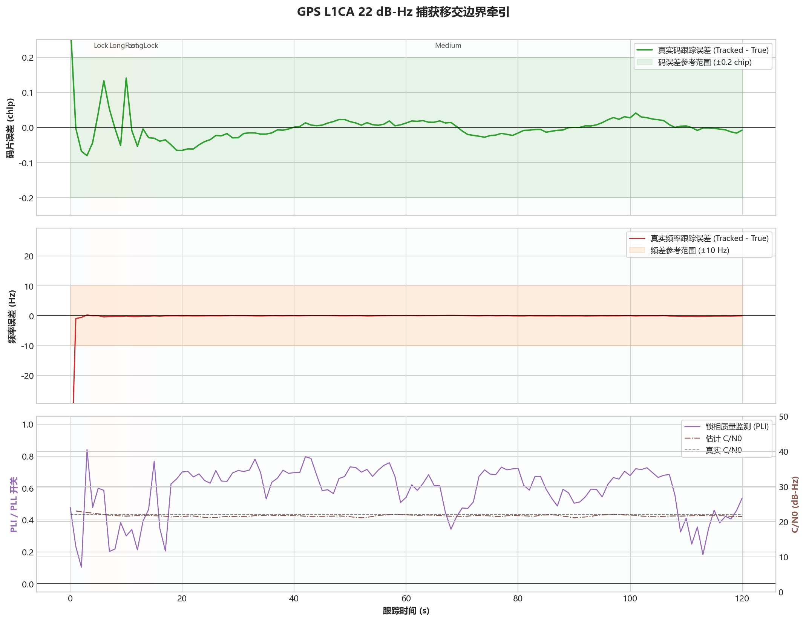
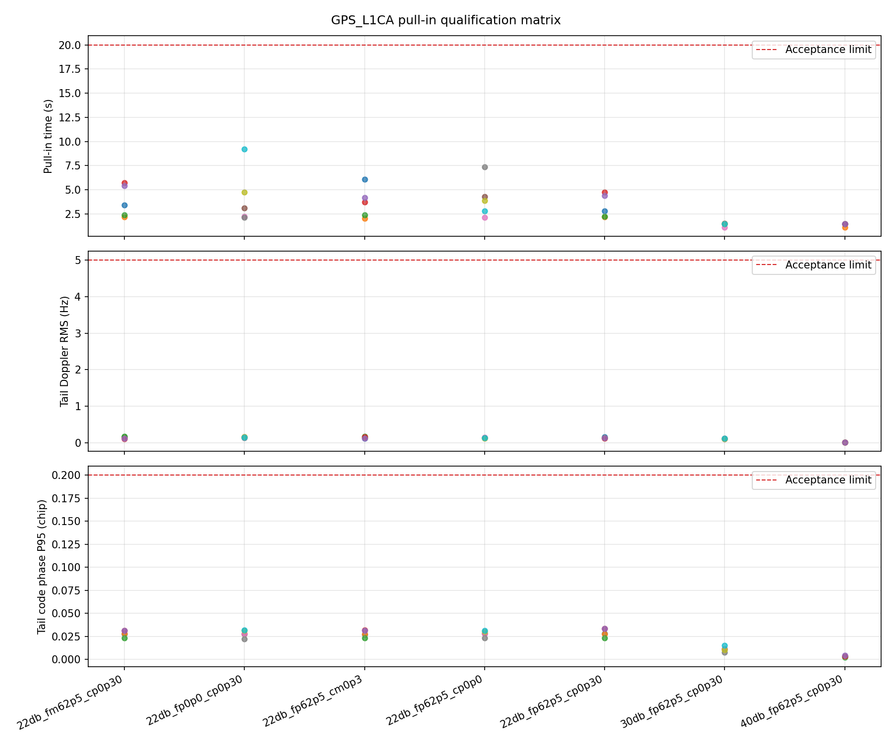
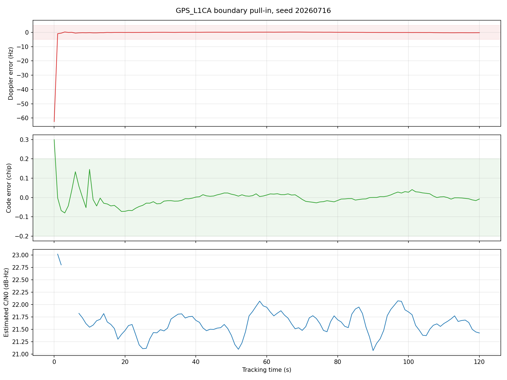

# GPS L1CA - 牵引灵敏度

固定案例 ID：`ST-GPSL1CA-01-PULL_IN_SENSITIVITY`

## 现实场景

验证接收机从捕获结果移交到稳定跟踪的能力。测试覆盖强信号、一般信号和目标牵引边界，并在目标边界叠加正负频率误差与正负码相位误差。

## 输入

- 信号：GPS L1CA。
- 数据源：StarGen 实时二进制管道，3-bit I/Q。
- 正式案例时长：每组 `120 s`。
- 时钟：`GOOD_TCXO_V1`。
- 无预置位同步，无已知电文辅助。
- 目标牵引灵敏度：`22 dB-Hz / -148 dBm`。
- 本次 Development 回归：种子 `20260716`，共 7 组代表性组合。

## 真值

信号连续施加 `0.020 Hz/s` 线性频漂、`0.000020 Hz/s^2` 加加速度及 `0.50 Hz / 120 s` 慢周期扰动。捕获移交误差由每组案例单独给定。

## 预期结果

- 成功退出 PullIn，不重新捕获、不丢同步。
- 多普勒 RMS 不超过 `5 Hz`，P95 不超过 `10 Hz`。
- 动态真实码相位误差 P95 不超过 `0.20 chip`。
- 强信号应在约 `2 s` 内退出 PullIn；边界弱信号按收敛质量自动延长，但不强制等待 30 秒。

## 实际结果

本次运行：`startrack-0795a62_l1ca-v3`，单种子 Development 回归。

| C/N0 | 捕获频差 | 捕获码误差 | PullIn 退出 | 多普勒 RMS | 码相位 P95 | 结果 |
|---:|---:|---:|---:|---:|---:|---|
| 22 dB-Hz | -62.5 Hz | +0.3 chip | 3.46 s | 0.0666 Hz | 0.0298 chip | 通过 |
| 22 dB-Hz | 0 Hz | +0.3 chip | 3.12 s | 0.0860 Hz | 0.0289 chip | 通过 |
| 22 dB-Hz | +62.5 Hz | -0.3 chip | 6.18 s | 0.0767 Hz | 0.0302 chip | 通过 |
| 22 dB-Hz | +62.5 Hz | 0 chip | 4.28 s | 0.0736 Hz | 0.0298 chip | 通过 |
| 22 dB-Hz | +62.5 Hz | +0.3 chip | 2.78 s | 0.0908 Hz | 0.0297 chip | 通过 |
| 30 dB-Hz | +62.5 Hz | +0.3 chip | 1.50 s | 0.0419 Hz | 0.0116 chip | 通过 |
| 40 dB-Hz | +62.5 Hz | +0.3 chip | 1.48 s | 0.0099 Hz | 0.0033 chip | 通过 |

上一版五种子 Qualification 结果仍保留在 `startrack-503cdea_pullin-v2`：35/35 组通过，最慢 PullIn 退出为 `9.22 s`。

## 结论

目标牵引边界 `22 dB-Hz / -148 dBm` 在本次七组单种子开发回归中全部通过；30 和 40 dB-Hz 均在 2 秒内完成移交。结果证明同一套 PullIn 参数能够覆盖强信号到牵引边界，不需要按灵敏度切换牵引参数。正式结论仍以已发布的五种子 Qualification 为准。
