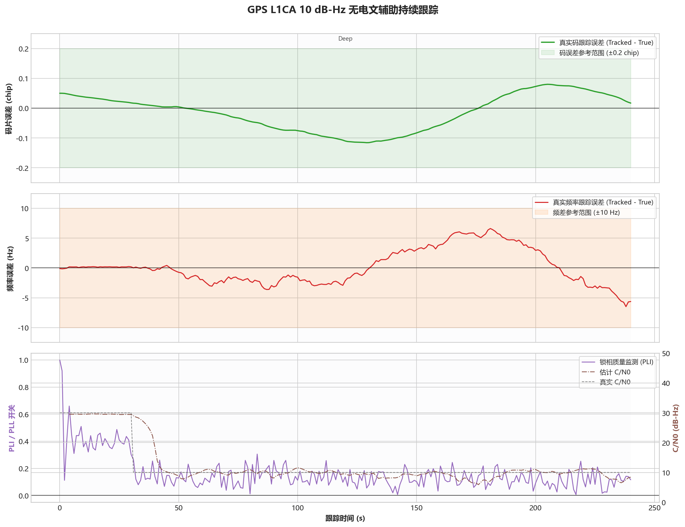

# GPS L1CA - 无电文辅助持续跟踪

固定案例 ID：`ST-GPSL1CA-02-SUSTAINED_UNAIDED`

## 现实场景

模拟位边界已建立、但接收机没有外部导航电文正负号的遮挡环境，验证强、中、极弱三档信号能否长期维持载波和码跟踪。

## 输入

- 信号：GPS L1CA。
- 数据源：StarGen 实时二进制管道，3-bit I/Q。
- 时钟：`GOOD_TCXO_V1`。
- 不提供已知电文位值。
- 目标持续灵敏度：`10 dB-Hz / -160 dBm`。
- 本次 Development 回归：种子 `20260716`，40、18、10 dB-Hz 各运行 `240 s`；弱信号档先用 30 dB-Hz 稳定 30 秒，再切换到目标强度。
- 固定 Qualification 定义仍为 30 dB-Hz 预热 60 秒后，在目标强度保持 900 秒，并使用 5 个固定种子。

## 真值

载波和码相位按 `GOOD_TCXO_V1` 连续演化，数据位和噪声序列不因测试档位而重置。误差统计均使用含多普勒码漂移的动态真实码相位。

## 预期结果

- 全程不重新捕获、不丢同步。
- 载波有效观测率不低于 `95%`。
- 多普勒 RMS 不超过 `5 Hz`，P95 不超过 `10 Hz`。
- 码相位误差 P95 不超过 `0.20 chip`。

## 实际结果

本次运行：`startrack-0795a62_l1ca-v3`。表中指标按目标平台的稳态评价区间统计，不把预热段混入弱信号结论。

| C/N0 | 多普勒 RMS | 多普勒 P95 | 码相位 P95 | C/N0 RMSE | 结果 |
|---:|---:|---:|---:|---:|---|
| 40 dB-Hz | 0.0090 Hz | 0.0169 Hz | 0.0027 chip | 0.472 dB | 通过 |
| 18 dB-Hz | 0.4011 Hz | 0.8547 Hz | 0.0494 chip | 0.585 dB | 通过 |
| 10 dB-Hz | 4.3225 Hz | 6.1575 Hz | 0.0782 chip | 1.704 dB | 通过 |

## 结论

单种子开发回归支持将 GPS L1CA 无电文辅助目标从 `12 dB-Hz / -158 dBm` 更新为 `10 dB-Hz / -160 dBm`。该结果通过精度门限，但 10 dB-Hz 的多普勒余量明显小于中强信号，仍需完成固定五种子、900 秒 Qualification 后才能声明正式灵敏度。
