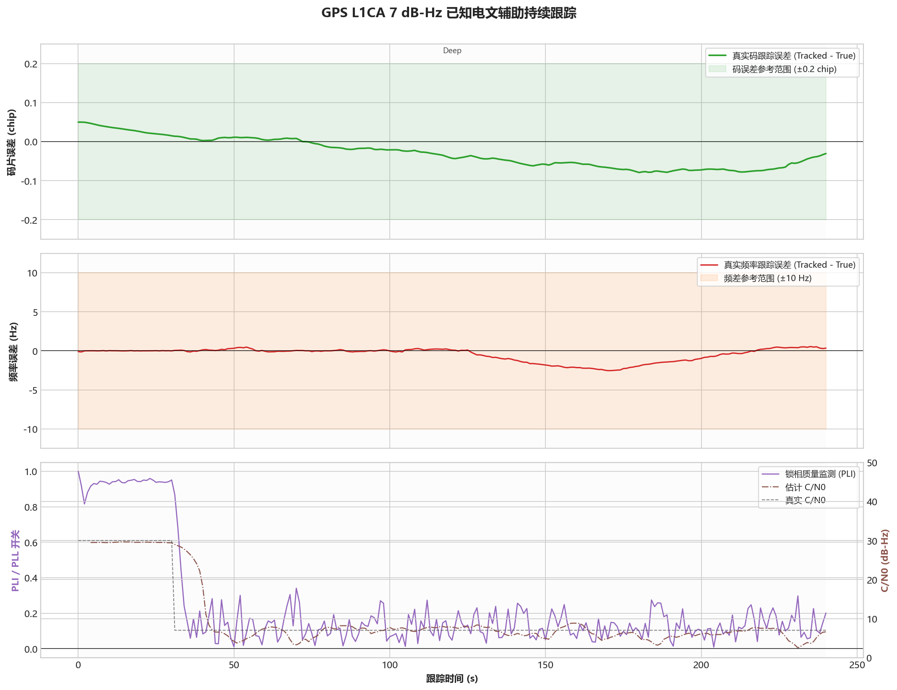

# GPS L1CA - 已知电文辅助持续跟踪

固定案例 ID：`ST-GPSL1CA-03-SUSTAINED_AIDED`

## 现实场景

模拟 A-GNSS 或其他可靠来源提供导航电文位值、位索引和时间映射后，在严重遮挡环境中维持 GPS L1CA 跟踪。

## 输入

- 信号：GPS L1CA。
- 数据源：StarGen 实时二进制管道，3-bit I/Q。
- 时钟：`GOOD_TCXO_V1`。
- 提供与信号发生器一致的已知电文位信息。
- 目标持续灵敏度：`7 dB-Hz / -163 dBm`。
- 本次 Development 回归：种子 `20260716`，先用 30 dB-Hz 稳定 30 秒，再在 7 dB-Hz 保持至 `240 s`。
- 固定 Qualification 定义为 30 dB-Hz 预热 60 秒后，在 7 dB-Hz 保持 900 秒，并使用 5 个固定种子。

## 真值

已知位值、位索引和时间映射与 StarGen 完全一致；载波和码相位叠加 `GOOD_TCXO_V1` 动态且连续演化。

## 预期结果

- 不重新捕获、不丢同步。
- 多普勒 RMS 不超过 `5 Hz`，P95 不超过 `10 Hz`。
- 码相位误差 P95 不超过 `0.20 chip`。
- C/N0 输出有效且不存在方法切换空窗。

## 实际结果

本次运行：`startrack-0795a62_l1ca-v3`。指标按 7 dB-Hz 稳态评价区间统计。

| C/N0 | 多普勒 RMS | 多普勒 P95 | 码相位 P95 | C/N0 偏差 | C/N0 RMSE | 结果 |
|---:|---:|---:|---:|---:|---:|---|
| 7 dB-Hz | 1.3962 Hz | 2.4705 Hz | 0.0779 chip | -1.196 dB | 1.808 dB | 通过 |

## 结论

`7 dB-Hz / -163 dBm` 已通过本次单种子 240 秒 Development 回归，频率和码相位均有明确余量。该结果验证当前辅助接口的性能上限，不代表尚未完成的五种子、900 秒正式 Qualification。
