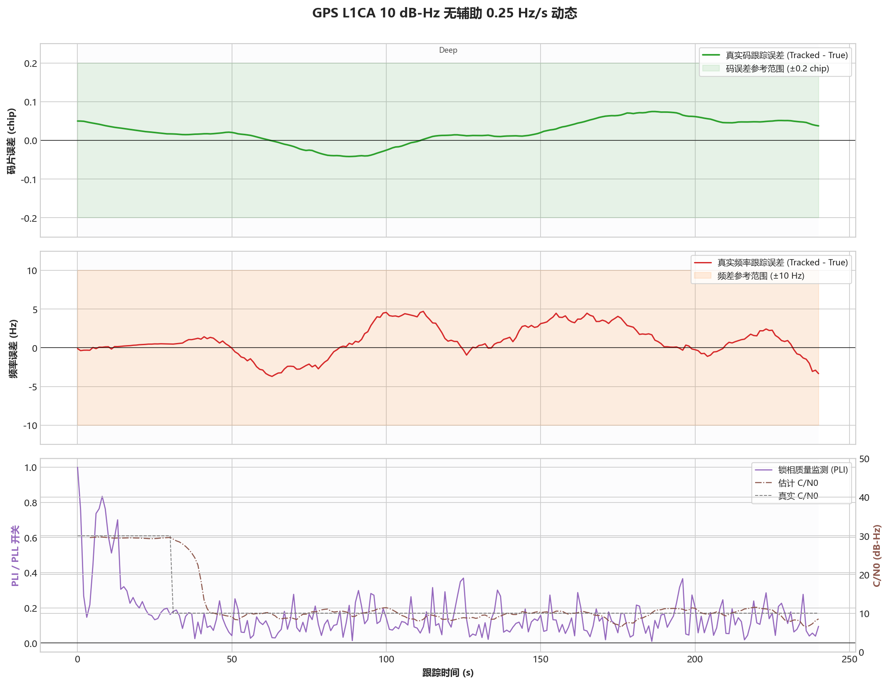
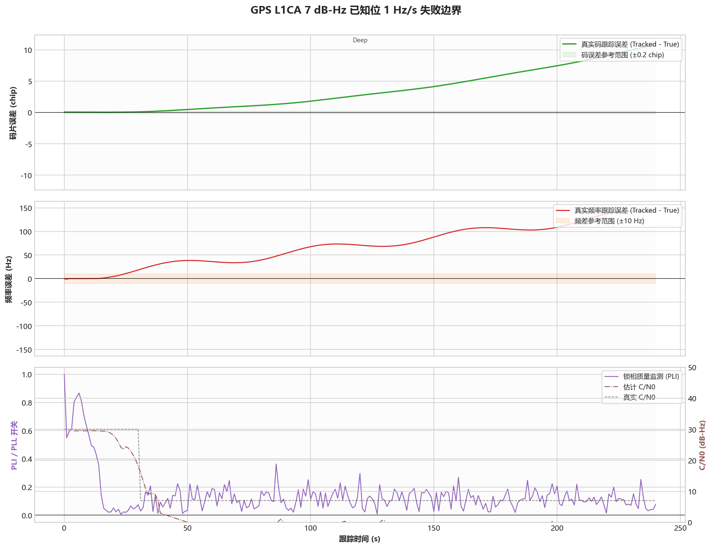

# GPS L1CA - 多普勒动态能力

固定案例 ID：`ST-GPSL1CA-04-DOPPLER_DYNAMICS`

## 现实场景

验证不同信号强度下对卫星运动和 TCXO 共同引起的多普勒变化的承受能力。测试采用有界动态，不使用会无限增长到非现实频偏的恒定斜坡。

## 输入

- 信号：GPS L1CA。
- 数据源：StarGen 实时二进制管道，3-bit I/Q。
- 时钟：`GOOD_TCXO_V1`。
- 本次 Development 回归：种子 `20260716`，每组 `240 s`。
- 覆盖 30 dB-Hz 与 `1 Hz/s`、10 dB-Hz 与 `0/0.25 Hz/s`、7 dB-Hz 已知电文辅助与 `0/1 Hz/s`。

## 真值

`GOOD_TCXO_V1` 基础扰动上叠加指定最大频率变化率的有界正弦多普勒。码相位真值同步包含载波多普勒导致的码漂移。

## 预期结果

- 多普勒 RMS 不超过 `5 Hz`，P95 不超过 `10 Hz`。
- 动态真实码相位误差 P95 不超过 `0.20 chip`。
- 不重新捕获，不因状态切换产生持续发散。

## 实际结果

本次运行：`startrack-0795a62_l1ca-v3`。

| C/N0 | 辅助条件 | 最大频率变化率 | 多普勒 RMS | 多普勒 P95 | 码相位 P95 | 结果 |
|---:|---|---:|---:|---:|---:|---|
| 30 dB-Hz | 无电文辅助 | 1.00 Hz/s | 0.082 Hz | 0.123 Hz | 0.011 chip | 通过 |
| 10 dB-Hz | 无电文辅助 | 0 Hz/s | 4.322 Hz | 6.158 Hz | 0.078 chip | 通过 |
| 10 dB-Hz | 无电文辅助 | 0.25 Hz/s | 2.170 Hz | 4.013 Hz | 0.073 chip | 通过 |
| 7 dB-Hz | 已知电文辅助 | 0 Hz/s | 1.396 Hz | 2.471 Hz | 0.078 chip | 通过 |
| 7 dB-Hz | 已知电文辅助 | 1.00 Hz/s | 119.819 Hz | 142.609 Hz | 10.505 chip | 失败边界 |

## 结论

本次必测动态点通过：30 dB-Hz 支持 `1 Hz/s`，10 dB-Hz 支持 `0.25 Hz/s`。`7 dB-Hz + 1 Hz/s` 明确失败，说明极限灵敏度与最大动态不能同时声明；该失败结果作为后续回归边界保留，不计入本轮必测失败。
