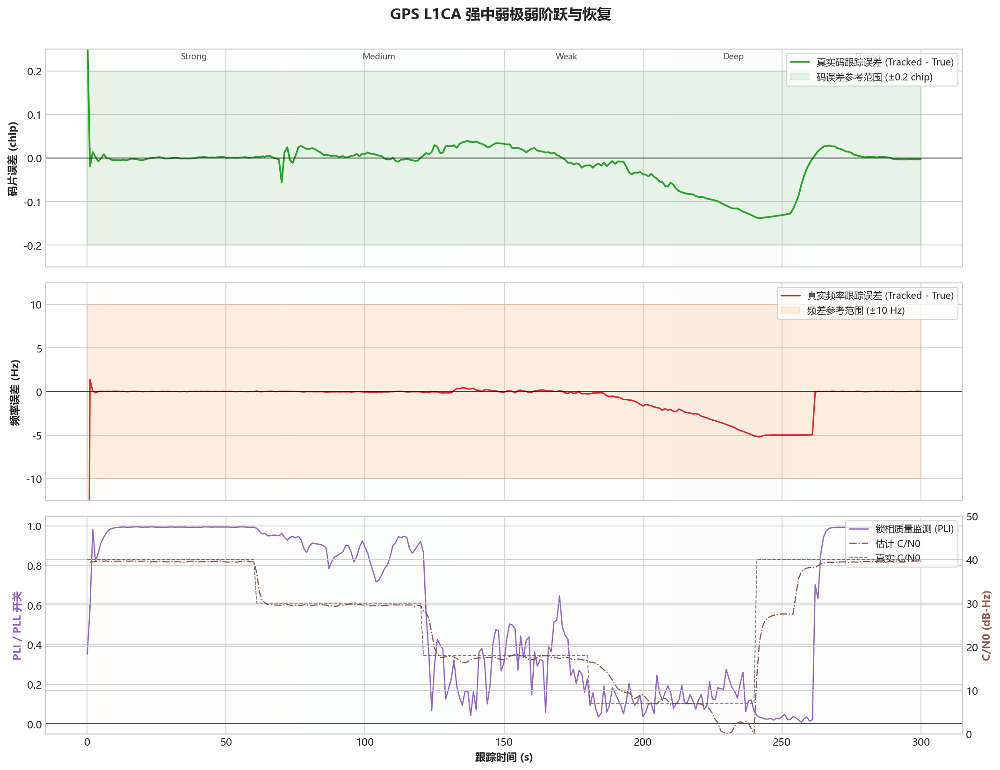

# GPS L1CA - 强弱阶跃切换

固定案例 ID：`ST-GPSL1CA-05-STEP_TRANSITIONS`

## 现实场景

模拟遮挡突然出现或消失时，信号在强、中、弱、极弱和强信号之间阶跃变化，检查接收机是否能及时响应且不因状态切换发散。

## 输入

- 信号：GPS L1CA。
- 数据源：StarGen 实时二进制管道，3-bit I/Q。
- 时钟：`GOOD_TCXO_V1`。
- 固定 Qualification 场景为 `900 s`。
- 本次 Development 压缩回归：种子 `20260716`，总时长 `300 s`，覆盖 40、30、18、7、40 dB-Hz 五个平台。

## 真值

C/N0 在规定时刻阶跃变化；噪声序列、载波相位、码相位和数据位连续，不在阶跃点重置。

## 预期结果

- 不重新捕获、不丢同步。
- 状态切换后误差能够恢复，不出现持续发散。
- 全程码相位误差 P95 不超过 `0.20 chip`。
- C/N0 稳态平台估计保持合理，切换延迟应与估计窗口相符。

## 实际结果

本次运行：`startrack-0795a62_l1ca-v3`。

| 指标 | 实际结果 |
|---|---:|
| 多普勒 RMS | 3.049 Hz |
| 多普勒 P95 | 5.016 Hz |
| 码相位 P95 | 0.135 chip |
| 重新捕获次数 | 0 |
| 切换后持续发散次数 | 0 |

五个平台的 C/N0 响应时间依次约为 `1、1、3、15 s`；排除切换后前 20 秒，稳态平台 C/N0 RMSE 依次约为 `0.46、0.47、0.63、3.29、0.74 dB`。

## 结论

压缩单种子场景通过，五档阶跃均未引发重捕或持续发散。极弱平台响应最慢，符合长观察窗的物理代价；该延迟将在正式 900 秒场景中继续验证。
