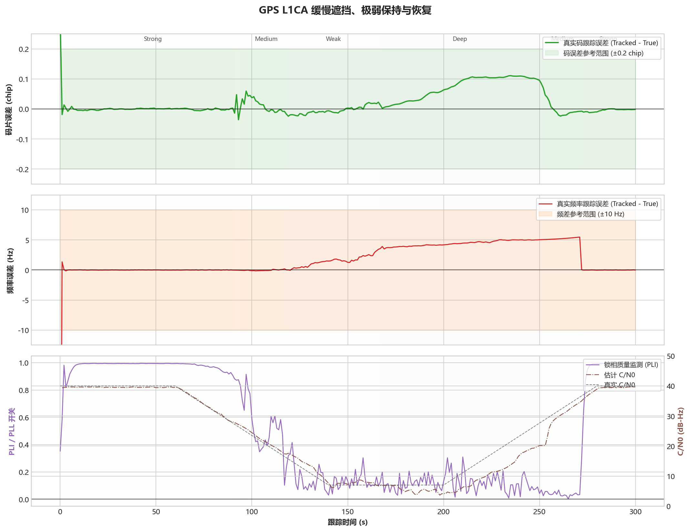

# GPS L1CA - 缓慢遮挡与恢复

固定案例 ID：`ST-GPSL1CA-06-SLOW_FADE_RECOVERY`

## 现实场景

模拟建筑、植被或车体遮挡逐渐加深后再逐渐消失的过程。相较于功率骤变，本场景更接近真实静态终端的信号衰减与恢复。

## 输入

- 信号：GPS L1CA。
- 数据源：StarGen 实时二进制管道，3-bit I/Q。
- 时钟：`GOOD_TCXO_V1`。
- 固定 Qualification 场景为 `900 s`。
- 本次 Development 压缩回归：种子 `20260716`，40 dB-Hz 缓降至 7 dB-Hz、保持并恢复，总时长 `300 s`。

## 真值

信号幅度连续变化，噪声密度、载波、码相位和数据位序列连续；码相位真值包含实时多普勒码漂移。

## 预期结果

- 全程不重新捕获、不丢同步。
- 状态变化方向与信号强弱一致，不在门限附近快速往返。
- 多普勒 RMS 不超过 `5 Hz`，P95 不超过 `10 Hz`。
- 码相位误差 P95 不超过 `0.20 chip`。

## 实际结果

本次运行：`startrack-0795a62_l1ca-v3`。

| 指标 | 实际结果 |
|---|---:|
| 多普勒 RMS | 4.126 Hz |
| 多普勒 P95 | 5.324 Hz |
| 码相位 P95 | 0.109 chip |
| C/N0 全过程 RMSE | 4.770 dB |
| 重新捕获次数 | 0 |
| 切换后持续发散次数 | 0 |

全过程 C/N0 RMSE 包含缓降、缓升期间估计窗口的固有滞后，不等同于稳态平台精度。

## 结论

缓慢衰减与恢复场景通过，频率和码相位误差保持在验收门限内，未出现重捕或状态切换后发散。正式 900 秒、多种子场景仍待运行。
