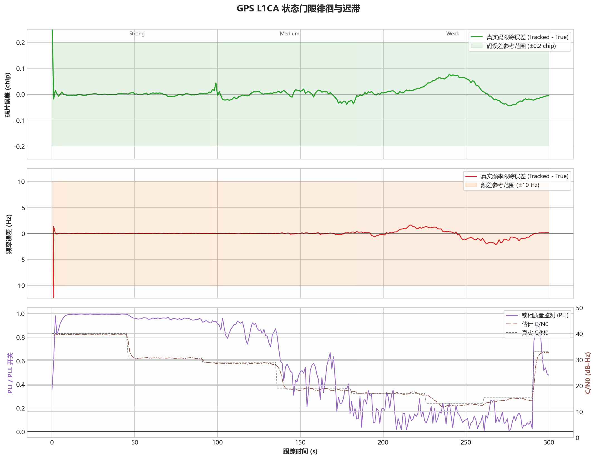

# GPS L1CA - 状态门限迟滞

固定案例 ID：`ST-GPSL1CA-07-THRESHOLD_HYSTERESIS`

## 现实场景

让信号强度在多个状态切换门限附近反复变化，验证状态迟滞和确认时间能否抑制抖动，同时保持闭环稳定。

## 输入

- 信号：GPS L1CA。
- 数据源：StarGen 实时二进制管道，3-bit I/Q。
- 时钟：`GOOD_TCXO_V1`。
- 固定 Qualification 场景为 `900 s`。
- 本次 Development 压缩回归：种子 `20260716`，总时长 `300 s`，在多个强弱门限附近往返。

## 真值

C/N0 按固定平台变化，载波、码、数据位和噪声序列保持连续，不利用重置信号相位帮助接收机。

## 预期结果

- 不重新捕获、不丢同步。
- 状态不在相邻门限间快速往返。
- 多普勒 RMS 不超过 `5 Hz`，码相位误差 P95 不超过 `0.20 chip`。

## 实际结果

本次运行：`startrack-0795a62_l1ca-v3`。

| 指标 | 实际结果 |
|---|---:|
| 多普勒 RMS | 1.020 Hz |
| 多普勒 P95 | 1.825 Hz |
| 码相位 P95 | 0.071 chip |
| C/N0 RMSE | 1.805 dB |
| 重新捕获次数 | 0 |
| 切换后持续发散次数 | 0 |

## 结论

单种子压缩场景通过。门限附近的功率往返未引发重捕、持续发散或不可控的状态振荡，说明当前迟滞方向正确；正式 900 秒、多种子 Qualification 仍待运行。
