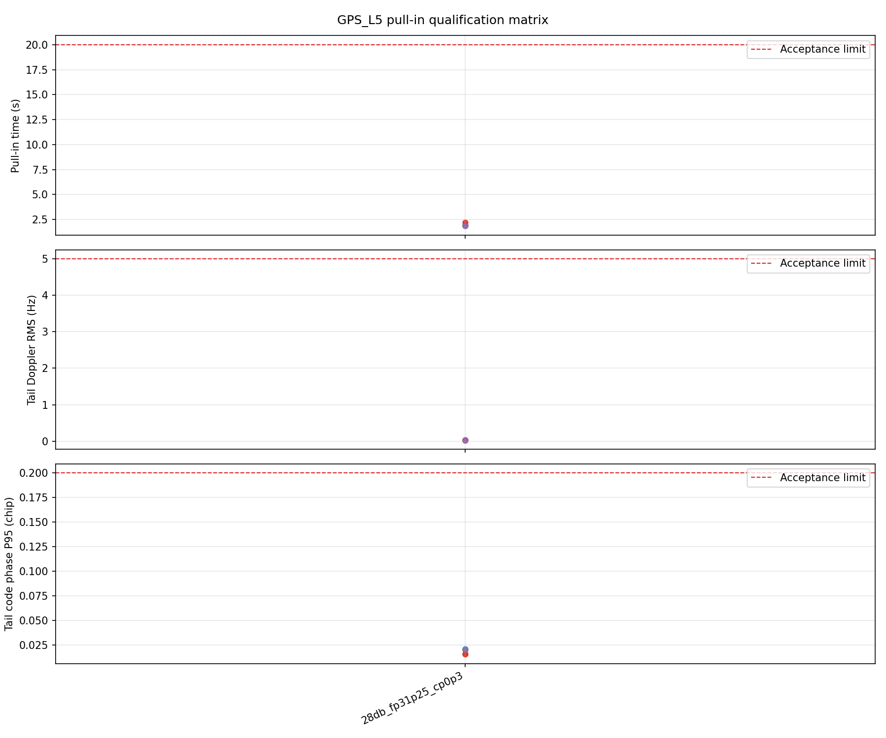
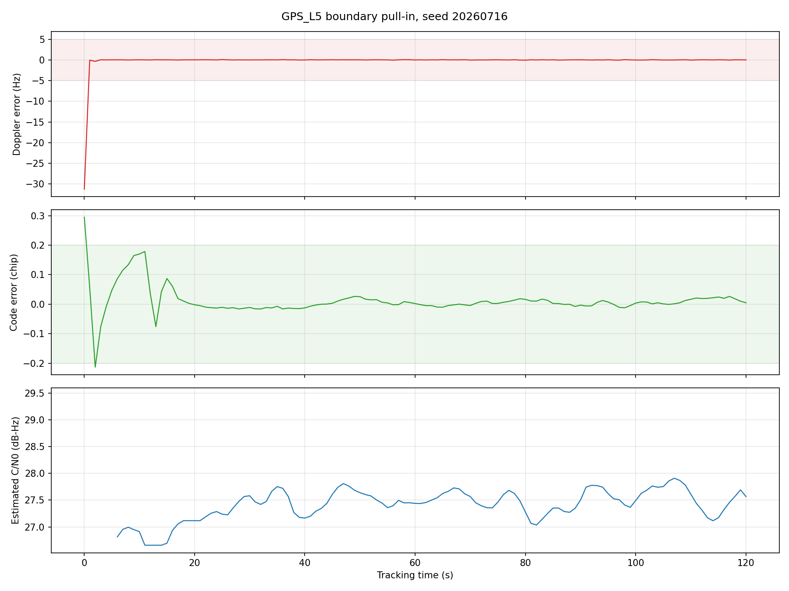

# GPS L5 - 牵引灵敏度

固定案例 ID：`ST-GPSL5-01-PULL_IN_SENSITIVITY`

## 现实场景

验证无同步、无电文辅助时从捕获结果移交到稳定跟踪的能力。

## 输入

- 信号：`GPS L5`
- 数据源：StarGen 实时二进制管道
- 单次时长：`120 s`
- 固定种子：`20260716, 20260717, 20260718, 20260719, 20260720`
- 输入过程：40、30 dB-Hz、目标牵引边界及边界以下1 dB；每档独立冷启动。

## 真值

捕获多普勒和码相位含规定移交误差，信号全程叠加 GOOD_TCXO_V1。

名义时钟使用 `GOOD_TCXO_V1`：线性频漂 `0.020 Hz/s`、加加速度
`0.000020 Hz/s^2`、慢周期扰动 `0.50 Hz / 120 s`。

## 预期结果

边界及以上全部种子完成同步和PullIn移交；下一低1 dB至少留一组失败或边界记录。

统一精度门限为：载波有效观测率不低于 `95%`，多普勒 RMS 不超过
`5 Hz`、P95 不超过 `10 Hz`，动态真实码相位 P95 不超过 `0.20 chip`。

## 实际结果

发布版本：`startrack-503cdea_pullin-v2`。

| 指标 | 实际结果 |
|---|---:|
| 固定种子 | 5 |
| 必测组合 | 5 |
| 通过组合 | 5/5 |
| 最慢 PullIn 退出 | 2.20 s |
| 最坏 Doppler RMS | 0.0342 Hz |
| 最坏 Doppler P95 | 0.0646 Hz |
| 最坏码相位 P95 | 0.0210 chip |

## 结论

GPS L5 在 `28 dB-Hz / -142 dBm`、`GOOD_TCXO_V1` 和 `+31.25 Hz / +0.3 chip`
捕获移交误差下通过五种子牵引 Qualification。当前发布只覆盖已经实际运行的
边界组合，其他移交误差组合仍保留为后续正式扩展项。
