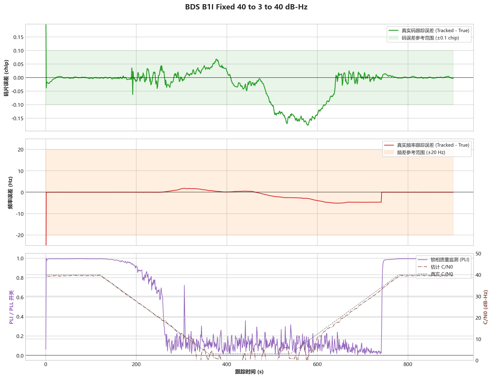

# BDS B1I - 固定参数40到3再到40 dB-Hz

## 测试目的

验证固定参数基线经历深衰落后能否随信号恢复返回强信号稳态。

## 输入

- 时长：900 s
- 随机种子：20260715
- C/N0 时间表：40 -> 3 -> 40 dB-Hz线性衰减和恢复
- 捕获移交误差：-62.5 Hz，+0.3 chip
- 多普勒动态：0.020 Hz/s初始频漂，0.000020 Hz/s^2加加速度，0.5 Hz/120 s正弦扰动

## 预期结果

不重新捕获，不出现切换后持续发散，末段恢复到Strong。

## 实际结果

- 频差 RMS：3.2503 Hz
- 频差 P95：5.0735 Hz
- 码相位误差 P95：0.1014 chip
- 变化率 RMS：0.0184 Hz/s
- 末段状态：Deep/Weak/Medium/Strong
- 800到900 s频差RMS：0.00968 Hz
- 跟踪判定：通过

## 结论

通过，信号恢复后稳定返回Strong。

