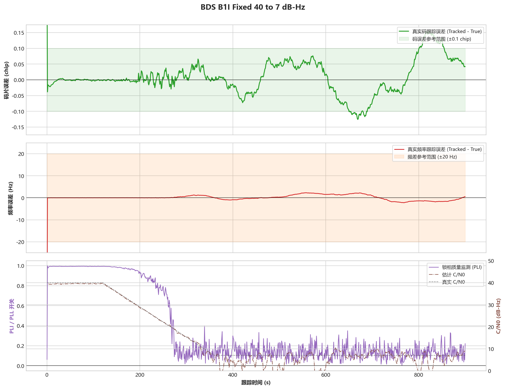

# BDS B1I - 固定参数40到7 dB-Hz

## 测试目的

验证固定参数基线从强信号缓慢进入极弱信号后的持续跟踪能力。

## 输入

- 时长：900 s
- 随机种子：20260715
- C/N0 时间表：0到120 s为40 dB-Hz，随后在360 s前线性降到7 dB-Hz并保持
- 捕获移交误差：-62.5 Hz，+0.3 chip
- 多普勒动态：0.020 Hz/s初始频漂，0.000020 Hz/s^2加加速度，0.5 Hz/120 s正弦扰动

## 预期结果

不重新捕获，稳定进入Deep；末段频差RMS不超过5 Hz，码相位误差P95不超过0.2 chip。

## 实际结果

- 频差 RMS：1.5144 Hz
- 频差 P95：2.1210 Hz
- 码相位误差 P95：0.1438 chip
- 变化率 RMS：0.0350 Hz/s
- 末段状态：Deep
- 跟踪判定：通过

## 结论

通过。

